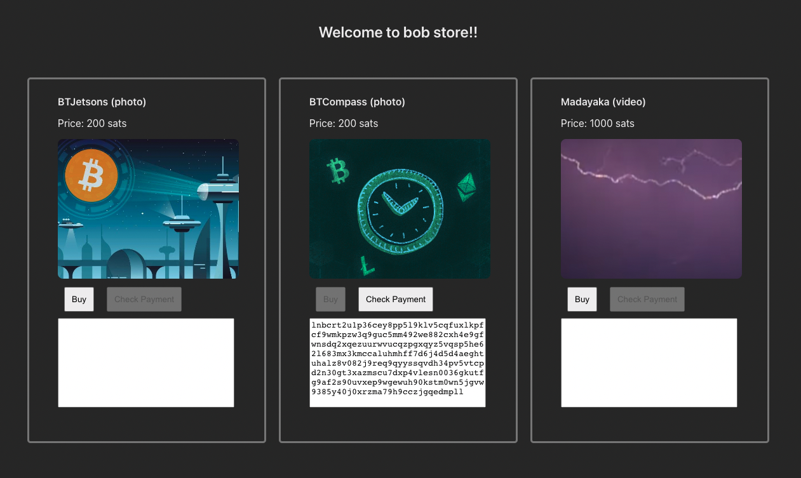

# lightning-network-media-store

Simple project that dont care about style / architecture guidelines.
Only purpose is connecting to lightning nodes, and creating invoices.

### DEMO

# Setup

- There are three values to be replaced on backend/app.js repo:
  - admin macaroon
  - lnd cert
  - node path:port

_You can find those values wrapped by carets <>_
